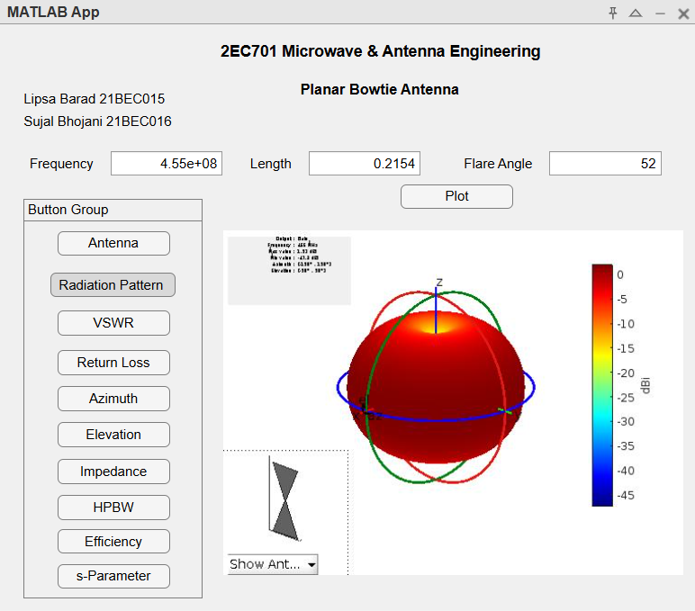

# Planar Bowtie Antenna MATLAB App  

This repository contains the MATLAB code and a graphical MATLAB app for simulating and analyzing a planar bowtie antenna. The app allows users to interactively input design parameters, generate plots, and evaluate the antenna's performance through an easy-to-use interface.  

---

## Design Parameters  

The table below outlines the key design parameters for the bowtie antenna:  

| **Parameter**            | **Value**   | **Equation (if applicable)**                                                                 |
|---------------------------|-------------|---------------------------------------------------------------------------------------------|
| Operating Frequency (f)   | 455 MHz     | -                                                                                           |
| Wavelength (λ)            | 659 mm      | $\lambda = \frac{c}{f}$, where $c = 3 \times 10^8 \, \text{m/s}$                             |
| Dipole Length (L)         | 204.6 mm    | $L = 0.31 \cdot \lambda$                                                                    |
| Dipole Width (W)          | 102.3 mm    | $W = 0.5 \cdot L$                                                                           |
| Flare Angle (α)           | 52°         | $\alpha = 2 \cdot \arctan\left(\frac{W/2}{L/2}\right)$                                       |
| Gap at connection point (g)| 10.8 mm     | -                                                                                           |
| Bandwidth (by VSWR < 2)   | 81 MHz      | Determined from the VSWR response where $\text{VSWR} < 2$                                   |

---

## App Features  

The MATLAB app is organized into an intuitive layout, as shown in the screenshot.  

1. **Interactive Input Fields:**  
   - Users can set parameters such as **Frequency**, **Length**, and **Flare Angle** in the input boxes.  

2. **Button Group for Analysis Options:**  
   - **Antenna Visualization:** Displays the bowtie antenna's geometry.  
   - **Radiation Pattern:** Generates the 3D radiation pattern plot.  
   - **VSWR:** Plots the Voltage Standing Wave Ratio over a defined frequency range.  
   - **Return Loss:** Shows the return loss graph for the specified range.  
   - **Azimuth and Elevation Patterns:** Displays side and front views of the radiation pattern.  
   - **Input Impedance:** Evaluates and visualizes impedance over a range of frequencies.  
   - **HPBW (Half-Power Beamwidth):** Computes the beamwidth for the azimuth angle.  
   - **Efficiency:** Displays the radiation efficiency of the antenna.  
   - **S-Parameters:** Plots the reflection coefficient ($S_{11}$) using S-parameters.  

3. **Dynamic Plots:**  
   - The right panel displays interactive plots such as the 3D radiation pattern and numerical results, updated based on user inputs.  

4. **Credits Section:**  
   - Includes details of contributors (e.g., student names and project information).  

---

## Key Equations  

1. **Wavelength:**  
   $$\lambda = \frac{c}{f}$$  
   Where $c = 3 \times 10^8 \, \text{m/s}$ is the speed of light, and $f$ is the operating frequency.  

2. **Dipole Length and Width:**  
   $$L = 0.31 \cdot \lambda \quad \text{and} \quad W = 0.5 \cdot L$$  

3. **Flare Angle:**  
   $$\alpha = 2 \cdot \arctan\left(\frac{W/2}{L/2}\right)$$  

---

## How to Run  

1. Clone this repository.  
2. Open the `.mlapp` file in MATLAB's App Designer or the `.m` script for command-line execution.  
3. For the app:  
   - Input the required design parameters.  
   - Use the side buttons to generate plots and evaluate antenna properties.
  

4. For the script:  
   - Modify the design parameters directly in the code.  
   - Run the script to generate outputs.  

---

